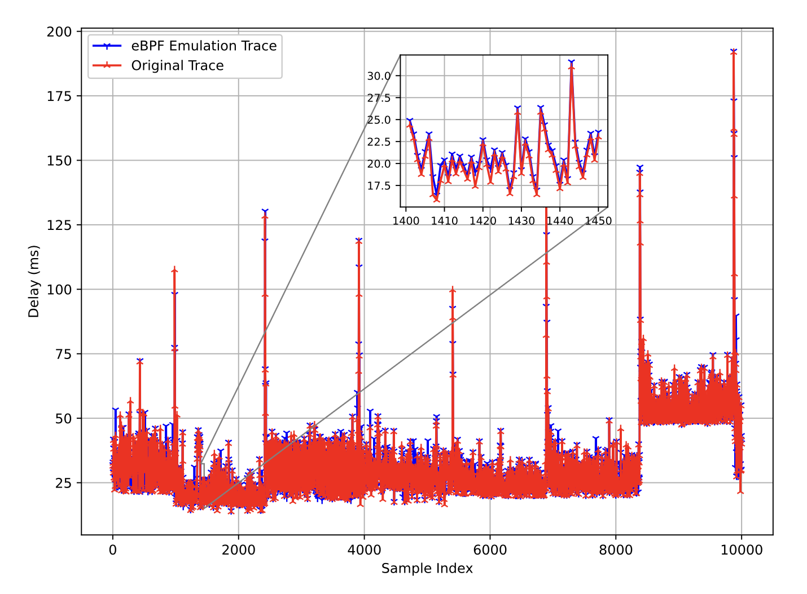

# 基于trace的TCP仿真办法

这项工作是我在大学阶段，根据当时的评测需求逐步形成的一套链路仿真办法。当时的研究方向是优化星链环境下的TCP传输性能。丢包会导致吞吐量明显下降，我们采用前向纠删编码（FEC）加以应对，并将方案部署在中间节点的PEP代理上。PEP之间的数据传输使用UDP，以便于嵌入FEC；在UDP之上我们实现了简化的拥塞控制，带宽估计与窗口调节参考了现有成熟算法，并支持CUBIC与BBR之间的切换。工具称为PEPesc。

要评测PEPesc，必须把它放在接近星链的链路上运行。初期我们使用TC、ns-3等传统工具构造星链环境，但它们都难以准确还原星链链路上分组的时延与丢包行为。与此同时，受多种因素限制，Starlink无法在国内直接使用。如何在本地复现这条链路，是本文要说明的问题。需要指出的是，该方法并不限于Starlink：凡是现有成熟工具难以还原的实际链路，只要能够获得时延与丢包轨迹，都可以采用类似的回放方式。

## 星链链路的时延与丢包特征

低轨卫星以较低的轨道高度换取较短的传播时延。中轨系统的单向时延常见为300～400ms，而低轨可降至约20～60ms，这是其在传输层性能上的主要优势。Starlink成为学术圈的热门对象，也与SpaceX在商业化上的进展有关：存在真实终端与真实用户流量，端到端行为可以被直接测量。

为维持轨道高度，低轨卫星必须保持较高的飞行速度。对地面终端而言，单颗卫星从入境到出境的可见窗口较短，要获得连续服务，就需要在不同卫星之间切换。以 Starlink为例，终端切换卫星的周期大约为15s。使用irtt或ping测量卫星链路的时延与丢包时，会得到图1所示的时延变化：曲线随切换呈台阶状起伏，并伴随突变。丢包同样随星间切换出现，规律性很弱，难以用恒定丢包率加以概括。

对拥塞控制而言，链路呈现的是一条随切换演化的时间序列，而不是围绕某一均值的平稳抖动；丢包则可能在短时间内成段出现。FEC 主要应对后者，CUBIC/BBR需要适应前者。若仿真无法复现图1这类轨迹，对PEPesc的评测就缺少可靠的信道条件。

## 现有仿真与模拟手段的不足

系统级性能评估通常借助仿真或模拟，在可复现的条件下考察协议与应用。离散事件仿真器（如ns-3、OMNeT++）在虚拟网络与虚拟协议栈上构建端到端连接，使用广泛，但必须先实现相应的协议模块。现有仿真器已覆盖计算机网络、移动网络乃至水声网络等场景，卫星网络模块的发展却明显滞后于网络建设。Starlink自2021年投入运营，LEO与非地面网络（NTN）也是6G中的重要方向，面向主流仿真器、可公开获取的Starlink或NTN模块仍然很少。已有工作中，sns3等模块主要面向地球静止轨道及DVB-S2/DVB-RCS2；多数LEO工具则停留在拓扑与移动性层面，并不包含可直接运行真实应用的底层协议栈。对PEPesc这类用户态代理而言，这一路径尤其不便。

另一类做法是网络模拟（emulation），例如Mininet、Dummynet：拓扑可以是虚拟的，但分组经过Linux内核中真实的TCP/IP协议栈。TC子系统中的netem等队列规则用于直接施加时延与丢包，而无需实现特定网络的协议过程。其优点是应用与通信均实时进行，能够反映真实协议栈的行为。局限在于，这类工具依赖统计模型描述时延与丢包的随机性。卫星网络、尤其是LEO场景下，卫星切换会使连接级时延与丢包呈现强动态、强非平稳特征，netem中现有的独立时延抖动与独立丢包模型难以刻画图1中的行为。我们初期使用TC、ns-3时遇到的，正是这一问题：环境能够运行TCP，却无法在分组尺度上对齐星链。

在无法稳定接入真实卫星网络的条件下，需要一种成本较低、又能保留真实协议栈的替代评测手段。

## 基于eBPF的轨迹驱动仿真

基于上述需求，我们采用端到端轨迹驱动的回放：不再为星链拟合一个时延或丢包分布，而是将测量得到的逐包（或逐时隙）时延与丢包作为信道信号，在本地链路上按序列复现。轨迹可来自irtt等测量工具，也可以在具备大规模数据时由生成模型合成。为了在内核数据路径上高效回放，实现上使用Linux的eBPF：在出口用TC与EDT改写分组的最早离开时间，以施加时延；在入口用XDP按丢包轨迹丢弃分组。应用与协议栈无需改写，PEPesc、iperf3、irtt只要经过该网卡即可。

卫星链路的往返时延不足以单独作为回放对象。上行与下行传播时延可以不对称，丢包也常常只发生在其中一个方向。因此我们从irtt日志中拆出四条序列：上行时延、下行时延、上行丢包、下行丢包。丢失分组没有有效时延记录，回放时将其时延取为前一分组的时延，并在丢包序列中标为1。时延施加于发送端出口，丢包施加于接收端入口，RTT由两个单向过程叠加而成，而不是对称地配置一条`netem delay`。

在Letters一文的表述中，轨迹为T = {t1, t2, …}，ti为第i个分组的时延，丢失则记为−1；eBPF map以`packet index`为键。测量间隔为10ms，验证时同样使用10ms间隔的irtt，于是一个探测分组一个10ms时隙与轨迹中的一格近似一一对应。回放结果与原始轨迹吻合较好。这一结果说明：在与测量相同的发送节奏下，按包序号回放是自洽的。当时我们将这一对应关系视为默认前提，并在该环境上评测PEPesc。

## Packet-driven与time-driven对TCP的不等价

将流量从irtt换为CUBIC/BBR以及PEPesc之后，回放出现了与校验阶段不同的偏差。问题不表现为整体时延平移数毫秒（那部分更接近仿真开销），而表现为轨迹被加速消耗：窗口增大后，时延变化比图1更密；丢包成簇出现，却与约15s的切换时间尺度不对齐；运行一段时间后，有限长度的轨迹被耗尽并开始循环。两条流并行时，甚至不像共享同一条链路。

我们首先从实现层面排查：Mininet中veth引入额外拷贝与协议栈开销；fq队列过浅会在仿真丢包之前先发生排队丢包；eBPF默认按irtt端口过滤，PEP或iperf3变更端口后，时延与丢包实际上没有作用于测试流。上述问题陆续得到修复后，irtt校验仍然成立，TCP仍会过快消耗轨迹。

原因在于索引方式默认了一种时钟。以packet index为键，意味着每到达一个分组，信道前进一格，即**packet-driven**。它在irtt上成立，是因为探测频率与测量频率一致。TCP并不按10ms等间隔发送。慢启动、ACK时钟、CUBIC的窗口增长以及BBR的pacing都会在短时间内产生突发。此时第i个分组与第i个10ms时隙」不再对应。随后我们补充了**time-driven**：按`bpf_ktime_get_ns()`以测量间隔（10ms）推进索引。同一时隙内到达的分组共享同一格信道状态。切换到时间驱动后，对PEPesc的评测才更接近图1所代表的链路，而不是更接近发送端自身的突发节奏。

二者对TCP的不等价，可以从几个侧面说明。

第一，突发会在单个RTT内压缩后续信道。若窗口一次发送约100个分组，而墙钟仅过去1～2ms，则packet-driven会连续取100格轨迹，相当于把约1s的星地几何变化压缩进不到一个往返；time-driven下这些分组仍处于同一或相邻时隙，看到的是同一时刻的传播时延。传播时延是时间的函数，并不随发送分组数加速。FEC所针对的切换丢包若按包推进，其持续时间也会随发送速率被拉伸或压缩，从而干扰对编码增益的判断。

第二，并行流可能在同一墙钟时刻读到轨迹的不同位置。发送更快的流推进索引更快，慢流仍停留在前面的时隙。公平性、收敛过程以及 PEP 两端是否面对同一条星链，都会因此失真。实际链路上，同一时刻的分组经历的是同一段传播介质。time-driven下索引只随物理时间变化，各流无法单独快进信道。

第三，空闲期内链路仍在演化。packet-driven在无分组时冻结索引，连接从空闲恢复时仍看到休眠前的时延；time-driven下1s对应100个时隙，恢复时可能已经完成一次切换。这对idle restart类行为的评测是有意义的。

因此，用与测量同频的CBR（如irtt）完成轨迹对齐，只能说明该发送节奏下回放自洽，并不能推出换用TCP后仍然自洽。两种索引只在测量间隔内恰好一包时重合。评测CUBIC、BBR或PEPesc时，应使用时间驱动。这一区分对其他链路的轨迹回放同样成立：只要待评流量的发送节奏不同于测量时的探测节奏，就不应用包序号作为信道时钟。

## 评测中的其他注意点

轨迹中的丢包来自低频探测，反映的是信道中断与切换，而不是瓶颈队列溢出。TCP或PEP将链路打满后产生的拥塞丢包，并不会自动出现在trace中。环境中另行配置的HTB限速与fq，用于提供容量约束并形成排队，从而触发拥塞控制。评测时应区分两层：轨迹负责非平稳传播时延与成段中断，HTB/fq负责带宽与排队。前者不宜解释为CUBIC打满瓶颈的结果，后者也不宜直接称为Starlink的实测丢包。FEC主要作用于前一层；拥塞控制主要在后一层工作，同时受到前一层时延跳变的影响。

Mininet便于在单机上部署双端节点，其性能特征与物理网卡并不相同。时延轨迹的相对变化可以作为评测依据，绝对值不宜与商业终端直接比较。方法本身可以部署在真实主机与真实网卡上。

此外，packet-driven下连接建立分组会占用轨迹前部的样本，造成后续对齐偏移；time-driven下握手只占用对应时长的时隙。同一时隙内多个分组共用同一时延值，这与短时间尺度上传播时延近乎不变是相符的，突发内部的排队延迟则来自HTB/fq，而不是轨迹插值。过滤器必须覆盖待测应用的端口，否则仿真实际上未生效。

## 小结

当时的需求是：在难以接入真实Starlink的条件下，评测一套面向星链的PEP、FEC与CUBIC/BBR实现。离散事件仿真缺少可用的协议模块，netem一类工具又依赖不足以描述切换过程的统计模型，因此我们改为将实测时延与丢包作为信号，用eBPF在真实协议栈上回放。Starlink是这一需求下的具体对象；对其他难以用现成工具还原的链路，只要能够采集或生成相应轨迹，也可以采用同一框架。

将轨迹定义为每个分组的时延，在与测量同频的探测下是恰当的。将其直接用于TCP时，包序号所隐含的时钟与物理时间不再一致：索引随分组推进时，信道成为发送过程的附属；索引随时间推进时，信道才对应图1中被测量的那条路径。评测前需要明确目标：是让拥塞控制看到路径随时间的演化，还是让每个分组依次经历测量中的每一个样本。前者对应time-driven，后者对应packet-driven。二者只在与测量同频的恒定速率流量下近似等价。

方法说明与示例轨迹见github.com/yeliqseu/ebpf-trace-emu。

## 参考文献

- W. Tian, Y. Li, J. Zhao, S. Wu, and J. Pan, "An eBPF-Based Trace-DrivenEmulation Method for Satellite Networks," IEEE Networking Letters,vol. 6, no. 3, pp. 188-192, 2024.
- Ye Li, Liang Chen, Li Su, Kanglian Zhao, Jue Wang, Yongjie Yang, Ning Ge, "PEPesc: A TCP Performance Enhancing Proxy for Non-Terrestrial Networks," in IEEE Transactions on Mobile Computing, vol. 23, no. 4, pp. 3060-3076, April 2024, doi: 10.1109/TMC.2023.3269436.
