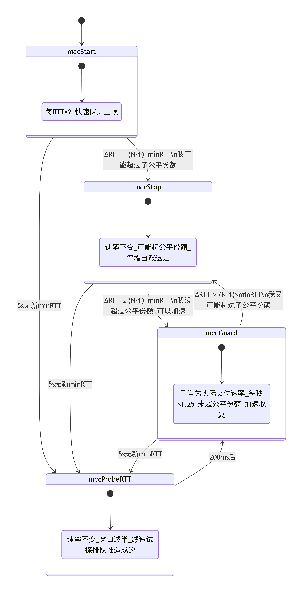

<h1 style="text-align:center">测量对拥塞的贡献程度</h1>
<h2 style="text-align:center">在AS20473到AS17816的HTTP3优化实践</h2>

本文分享我设计一种拥塞控制算法，我称为mcc算法的过程和展望。

## 背景

我有一个使用AS20473网络的VPS，我在上面运行着我自己的web服务，同时支持HTTP2和HTTP3。我常在夜间进行开发，我使用AS17816的网络，我注意到，HTTP2协议的速度明显快于HTTP3。

我对vps进行过调大缓存区等优化，我仔细排查了所有操作，最后注意到，HTTP2传输层使用tcp，我设置拥塞控制使用bbr，HTTP3使用quic-go实现，我查看源码发现，它拥塞控制使用的是NewReno变种（初始拥塞窗口32，乘性减小因子0.7）。

由于上游多年积压关于bbr的issue，我自行fork实现了bbr v1，代码在https://github.com/qiulaidongfeng/quic-go/blob/master/internal/congestion/bbrv1.go ，感谢http://arthurchiao.art/blog/bbr-paper-zh/ ，高质量的翻译很大程度帮助了我。

随后我注意到，我的网络环境，夜间丢包率在2-10%，bbr v1有时在这类链路表现还有进步空间，主要是更高的带宽利用率和更好的公平性。bbr后续版本重新引入了基于丢包率的反馈，我决定按照这个链路的特点设计新的拥塞控制算法。

## 设计目标

- 能在10%丢包的广域网运行
- 保持高带宽利用率
- 快速收敛到公平份额
- 与其它拥塞控制算法近似公平

## 网络环境介绍

- 发送端：AS20473 Vultr单核VPS 内核 6.12.95+deb13-amd64
- 接收端：AS17816 Windows11
- 链路情况：瓶颈带宽约160+Mbps，测得最小RTT240.13ms，通常平均RTT约280+ms，丢包白天较低，1%以内，夜间较高2-10%

## MCC设计过程

### 设计思想

如果网络中每个流都能保持在公平份额（满足最大最小公平的份额），全局自然公平。然而，感知到其它流是需要时间的，不可能任何时候都在上帝视角做出完美的决定。

因此，设计转为更加实现更加现实的，**如果每个流都能对拥塞作出尽可能少的贡献，便可以控制拥塞，实现近似公平**。

**这里的拥塞是按照bbr v1论文中的定义**，`拥塞（congestion）就是 inflight 数据量持续向右侧(大于测)偏离 BDP 线的行为， 而拥塞控制（congestion control）就是各种在平均程度上控制这种偏离程度的方案或算法。`

### 设计选取指标

丢包由于链路特性，我们不能将其作为参考。

RTT能较好的反映一些链路的特性，因为选择此作为参考。

具体来说，bbr v1认为，**一段时间的最小RTT**`就是这条路径（在一段时间内）的往返传输延迟`，按照mcc的设计思想，我们认为，那就**近似一条流对拥塞没有做出贡献的基线**。

而**当前的RTT减去一段时间的最小RTT的差值，就反映一条流对拥塞的贡献程度**。后文简称差值。

上述是单流模型，如何推广到多流，见[mccProbeRTT](#mccprobertt)描述的如何通过试探，确定对拥塞的贡献程度属于self的部分。

为避免网络波动的影响，mcc使用当前的平滑RTT。

### 如何判断对拥塞的贡献程度

最初，我试图将这种差值控制在一个绝对值，比如200ms，后来我注意到着不太能实现设计目标，因为改为不得超过1倍或2倍的最小RTT，称为阈值。主要是为了应对延迟ACK和适度利用缓冲区以提高带宽利用率。

### mcc的四个阶段

#### mccStart

本质是慢启动。

BDP下限为128MSS，初始也为128MSS，以便更快的探测瓶颈带宽，BDP上限呈指数级别增长。

平滑RTT因子试过1/8和1/4，结果1/4能更快的适应网络变化，加快收敛到近似公平，因此选择此。

值得说明的是，mcc中，实现的是quic-go中的拥塞控制接口，CanSend表示是否还有拥塞窗口，mcc的只要RTT差值没有超过阈值或没有接近bdp上限就可以继续发送，这似乎可以超出bdp上限。但这没有关系，HasPacingBudget控制pacing，如果当前交付速度达到上限，就不能发送。这种CanSend逻辑是为了更高的应对延迟ACK。

当测得对拥塞的贡献程度大时，进入mccStop。

#### mccStop

类似快速恢复。

这个阶段，将BDP上限保持在当前，不改变，直到进入mccProbeRTT后切换到mccGuard,或测得不在对拥塞的贡献程度大，直接进入mccGuard。

这样做的目的，首先利好新流加入，其次是避免像AIMD流反复退让导致不公平。

#### mccGuard

类似bbr的Probe_BW。

这个阶段，BDP上限重设置为根据当前实际交付速度和最小RTT计算的值，然后每秒增长1.25倍（这比RTT>125ms的bbr v1增长速度快），这是为了在与bbr等算法的竞争中确保不被压制。

#### mccProbeRTT

每当超过5秒没有探测到新的最小RTT时进入此阶段，维持200ms，期间将BDP上限临时减半，并不得增长。

这个阶段，如果进入前有观察到RTT上涨，刚好减速能试探，这种上涨是不是自己造成的。从而决定是进入mccGuard还是mccStop，来做到**不因为其它流制造的排队惩罚self，只惩罚self制造的排队**。

以下是AI生成的mcc状态机图



### mcc公平性理论

一般情况，mcc大多数时候差值没有超过阈值，当检测到超过时，意味着两种情况，自身占用远远超出瓶颈带宽的份额，或其它流加入，这两种情况，在进入mccStop后，都会保持原有的发送节奏，**但实际的交付速度不会超过瓶颈带宽，也不会比之前更快**。

- 如果是新流加入，则新流加入会降低mcc流的交付速度，mcc在这个交付速度变慢的过程中让出超过公平份额的占用，并在退出mccStop时修正自己的BDP上限。
- 如果是自身原因。mcc也将收敛至新的瓶颈带宽。
- 如果遇到过于霸道的流，始终占用比公平份额更多的缓冲区，至多5.2秒后，再次进入mccProbeRTT，然后新的更高的最小RTT，使得mcc认为自身对拥塞的贡献程度不大，所以继续加速，这样即使面对STARTUP阶段的bbr流，mcc也会与bbr流进入其它阶段时实现动态收敛。

这种基于实际交付速度去修正BDP上限的过程反复发生，就是mcc实现动态收敛至公平份额的机制。

但这是缓冲区充足时的行为，mcc在缓冲区不足时的行为，尚需研究。

### mcc理论吞吐的代数表达

假设：

流A为mcc流，网络路径为AS1->AS中间节点1->AS3。

流B网络路径为AS2->AS中间节点1->AS4。

AS中间节点1的转发速度为C，AS3的接收速度为x，AS4的接收速度为y。

任意两个AS之间链路的缓存区充足（大于所有流各自的2或3倍BDP之和）；各流慢启动阶段已经结束。

应用层发送速度大于目的地AS的接收速度。

则任意情况，如果x+y<=C，各流平均速度近似x,y。

#### 如果流B为mcc流
如果x+y>C，各流平均速度近似C/2(流数量)，瞬时速度也在经过几次震荡后长期很接近。

#### 如果流B为bbr或cubic流
如果x+y>C，各流平均速度近似C/2(流数量)，但流B在Probe_BW时，可能出现瞬时速度上升，甚至短暂压制流A。

举例说明，假设缓冲区6MB，各流真实BDP1MB，流A流B瞬时速度x1,x2，某一时刻均分带宽，此时占用缓冲区（2或3MB+1MB）。

然后流B加速使得占用加大，探测到最大带宽超过C/2，**此时x2>C/2>x1**，接着两个流先后探测MINRTT偏大，然后错误的加速，结果mcc加速更快，缓存区占用比例升高，随之夺回并超过公平份额，**此时x1>C/2>x2**，随后mcc测出接近正确的MINRTT，bbr因为发现最大带宽降低，cubic流则是因为丢包，最终竞争产生平均速度近似C/2。

#### 如果流B为NewReno流

由于NewReno在长肥链路拥塞避免增窗口慢，因此可能难以近似公平，即x+y>C时，最坏情况流B每次退让，流A马上抢占，流B速度减小到C-x。（这更可能发生在长肥链路，即NewReno不适合的场景）

### 后续展望

在实测中（缓冲区充足，4条mcc流先后进入链路竞争，第4条进入时，第1条即将退出），阈值1倍最小RTT的，我称为低延迟模式，它的带宽分配和最大延迟表现都较为优秀，但带宽利用率任有提升空间。

而阈值为2倍最小RTT时，它的带宽利用率令人满意，而且带宽分配近似公平，但部分流的尾部最大延迟极高。此外在多条mcc流占用大多数带宽时，给其它协议流让出带出的速度不够快。

以下为阈值为2的测试结果（按流加入顺序，测试时白天，丢包约0.4%）
```
50.201112 Mbps/s
最小rtt262.6447ms 平均rtt差76.628ms
49.476228 Mbps/s
最小rtt246.0695ms 平均rtt差61.697ms
46.778996 Mbps/s
最小rtt261.0302ms 平均rtt差19.418ms
56.842928 Mbps/s
最小rtt278.691ms 平均rtt差21.471ms
```

如何在保持jain指数>0.99的情况，修正两种阈值的不足，尚需思考。

mcc实现在：https://github.com/qiulaidongfeng/quic-go/blob/master/internal/congestion/mcc.go

仓库issue可用，欢迎反馈。